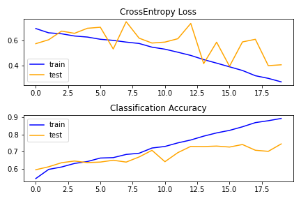
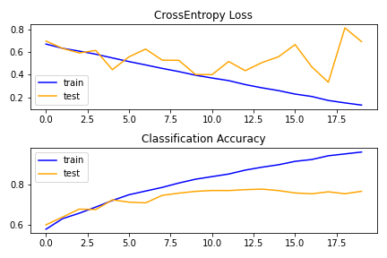
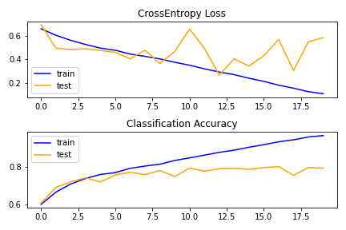
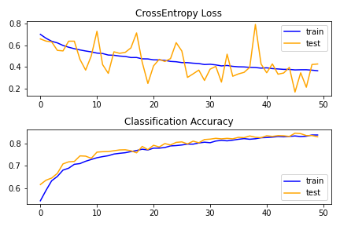
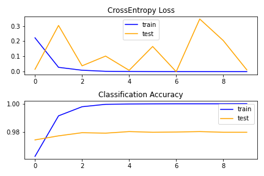

# Cats vs Dogs Classification with CNNs and Transfer Learning
This project uses a dataset from a kaggle competition which was help previously. The dataset comprises of photos of dogs and cats from a much larger dataset of 3 million manually annotated photos.
The given dataset comprises of 25000 labeled photos: 12500 dogs and 12500 cats.
The dataset can be downloaded from [here](https://www.kaggle.com/c/dogs-vs-cats/data).

## Goal
Goal of this project is to get hands on with Convolutional Neural Networks and explore different variations of them along with regularization techniques such as Data Augmentation and Dropouts.

## Steps Involved
Various steps in this project are as follows:
1. Set up kaggle in colab
2. Download the dataset using Kaggle API
3. Organise the dataset in required format
4. Define various utility functions which will help in execution and evaluation of models
5. Define different architectures of model
6. Implement image augmentation to reduce overfitting.
7. Finally, use a pretrained VGG-16 model to fit and test our data with the help of Transfer Learning.

## Summary
1. One Block VGG Architecture: 74.504% Accuracy
2. Two Block VGG Architecture: 76.598% Accuracy
3. Three Block VGG Architecture: 79.280% Accuracy
4. Three Block VGG Architecture with Image Augmentation: 82.929% Accuracy
5. Pre-trained VGG-16 Architecture: 97.985% Accuracy

## Plots

**One Block VGG Architecture**

**Two Block VGG Architecture**

**Three Block VGG Architecture**

**Three Block VGG Architecture with Image Augmentation**

**VGG-16 Pre-Trained Model**

