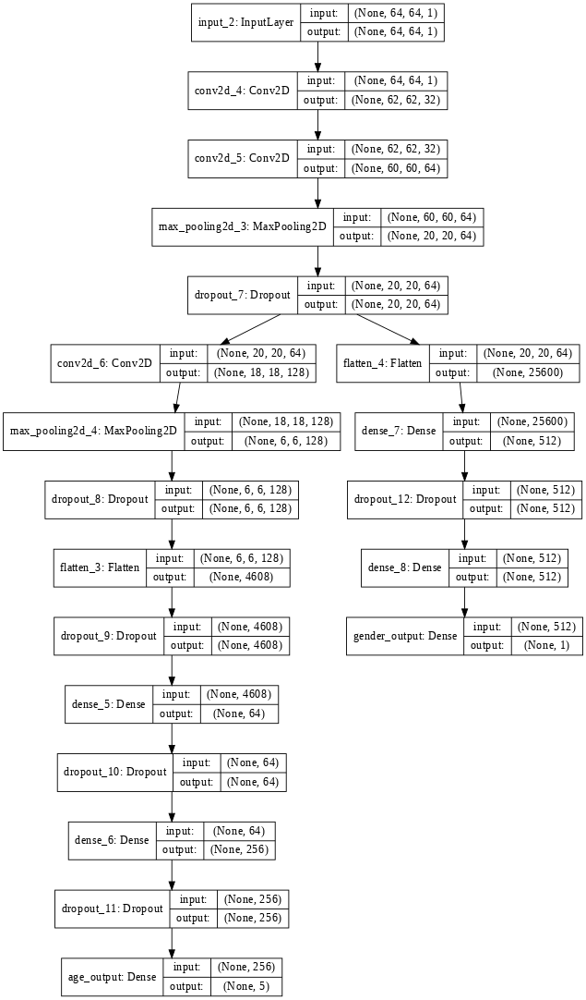
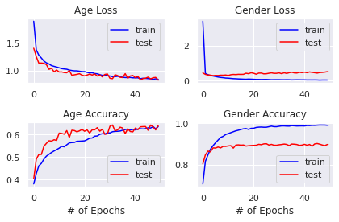

# Age and Gender Estimation  using Multi-Task CNN

### Dataset Used
The dataset is from kaggle. It contains 20,000 face images with annotations od age, gender and ethnicity. However, I just focused on age and gender. You can download the dataset from [here](https://www.kaggle.com/jangedoo/utkface-new).

### Model Structure
</img>

### Summary
