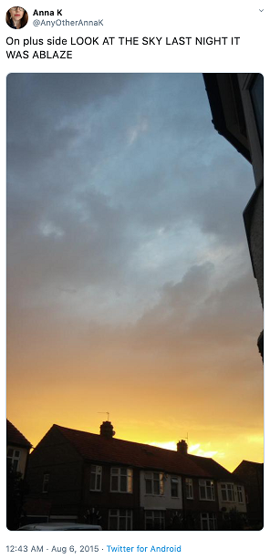

# Real or Fake Natural Disaster Prediction using Twitter data - Kaggle Competition

**<u>Public Score</u>** : 0.80

## Overview

Twitter has become an important communication channel in times of emergency.
The ubiquitousness of smartphones enables people to announce an emergency they’re observing in real-time. Because of this, more agencies are interested in programatically monitoring Twitter (i.e. disaster relief organizations and news agencies).

But, it’s not always clear whether a person’s words are actually announcing a disaster. Take this example:

The author explicitly uses the word “ABLAZE” but means it metaphorically. This is clear to a human right away, especially with the visual aid. But it’s less clear to a machine.

In this competition, you’re challenged to build a machine learning model that predicts which Tweets are about real disasters and which one’s aren’t.

## Data

Columns

    id - a unique identifier for each tweet
    text` - the text of the tweet
    location - the location the tweet was sent from (may be blank)
    keyword - a particular keyword from the tweet (may be blank)
    target - in train.csv only, this denotes whether a tweet is about a real disaster (1) or not (0)

## Methods Applied

1. Bag of Words
2. Word Vectors
3. LSTMs

**Word Vectors** along with **Support Vector Machines** gave the highest f1-score of 0.80 on public leaderboard.